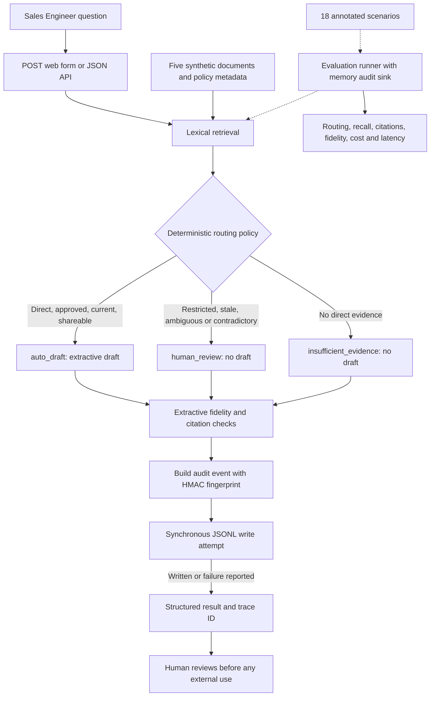

# TrustReply

TrustReply helps Sales Engineers handle sensitive B2B security and privacy questions using a small evidence corpus. It prepares a sourced draft when the evidence meets explicit rules, routes uncertain cases to an expert, and abstains when direct evidence is missing.

**Phase 1 delivered: Deterministic Guardrails & Audit Engine.** Run the complete baseline locally without an API key, a model download or Docker.

## Architecture

The diagram shows the delivered Phase 1 flow; no LLM participates in the decision.



## Phase 1 (Delivered)

| Capability | What the baseline demonstrates |
| --- | --- |
| Deterministic routing | Only a selected source marked approved, current and shareable, without ambiguity or contradiction flags, enables a draft. Other cases route to review or abstention. |
| Extractive fidelity | Draft sentences are checked against returned cited excerpts after normalization; unknown document IDs are flagged. |
| Privacy-conscious audit | Versioned JSONL events include trace IDs, corpus hash, decision criteria, citation IDs and metrics. Questions use HMAC-SHA-256 fingerprints; raw questions, drafts and excerpts are excluded from audit events. |
| Failure isolation | Audit write failures produce an operational error while preserving the business response. Tests use memory collectors and temporary files. |

**Validated on Python 3.12.7: 27 passing tests and 18 Golden Dataset scenarios.**

| Reference-set metric | Result |
| --- | --- |
| Route accuracy | 100% |
| Abstention / human-review / out-of-domain recall | 100% each |
| Expected citation-ID matching | 100% |
| Unsupported / forbidden claims and invalid citations | 0 each |

These are regression results on the annotated synthetic dataset, not a measure of real-world accuracy. Fidelity checks currently report violations; they do not constitute a fail-closed validator for arbitrary generated text.

## Quickstart

Prerequisites: Git, **Python 3.12**, and internet access to clone the repository and install the locked dependencies. Linux also needs Python's venv support. Choose your platform and run the three lines below; no environment activation or API key is required.

### Windows — PowerShell

```powershell
git clone https://github.com/thomas-laudic/ai-solutions-portfolio.git trustreply
Set-Location trustreply; py -3.12 -m venv .venv
.\.venv\Scripts\python.exe -m pip install -r requirements.lock; if ($LASTEXITCODE -eq 0) { .\.venv\Scripts\python.exe -m pytest tests/ -v -s }
```

### Linux — Bash

```bash
git clone https://github.com/thomas-laudic/ai-solutions-portfolio.git trustreply
cd trustreply && python3.12 -m venv .venv
.venv/bin/python -m pip install -r requirements.lock && .venv/bin/python -m pytest tests/ -v -s
```

Expected: the Golden Dataset metrics above and a final **27 passed** summary. `tests/` includes `tests/eval/`. Installation time depends on the network; subsequent tests run locally without external model calls. Windows is the locally verified platform; the Linux commands use the equivalent venv layout and have not yet been validated in Linux CI.

To try the web interface after the tests:

```powershell
# Windows
.\.venv\Scripts\python.exe -m uvicorn trustreply.app:app --app-dir src
```

```bash
# Linux
.venv/bin/python -m uvicorn trustreply.app:app --app-dir src
```

Open [the local demo](http://127.0.0.1:8000/) and try the three example buttons. The API documentation is at [localhost/docs](http://127.0.0.1:8000/docs).

## Explicit limits

- Five synthetic documents and 18 annotated questions; no real customer data or compliance certification.
- Retrieval uses lexical overlap and thresholds. Ambiguity, contradiction and freshness come from corpus metadata, not automatic semantic analysis.
- Fidelity is extractive matching, not semantic entailment or independent verification that a returned excerpt matches its source file.
- HMAC provides pseudonymization, not anonymity. Without a configured local key, fingerprints change when the process restarts.
- JSONL storage is local and intended for one server process. It is not immutable, has no automatic rotation, and an audit failure can lose an event.
- No LLM, authentication, collaborative review workflow or automatic sending. A human remains responsible for external use.

## Roadmap by delivery phase

- [x] **Phase 1 — Delivered:** deterministic routing, extractive drafts, 18-scenario evaluation, POST demo and HMAC audit. Merged into `main` through [PR #1](https://github.com/thomas-laudic/ai-solutions-portfolio/pull/1).
- [ ] **Phase 2 — In progress (design):** specify and test a fail-closed LLM boundary. Only eligible `auto_draft` cases may reach a generator; review and abstention paths must make zero model calls. Define output rejection and error handling before connecting a provider. No LLM integration is delivered yet.
- [ ] **Phase 3 — Planned:** evaluate hybrid lexical and semantic retrieval against an expanded reference set. Compare retrieval quality and routing regressions before selecting dependencies or infrastructure.

Each phase should remain independently testable. This showcase is prepared on `codex/github-showcase`; the planned next implementation branch is `codex/llm-draft-boundary`. Future phases do not require an API key to run Phase 1.

## Architecture and implementation notes

- [Project brief and current tasks](docs/PROJECT.md)
- [Architecture decisions](docs/DECISIONS.md)
- [API, decision policy and local demo](docs/VERTICAL_SLICE.md)
- [Golden Dataset, metrics and fidelity limits](docs/EVALUATION.md)
- [Audit schema, local configuration and failure behavior](docs/AUDIT.md)
